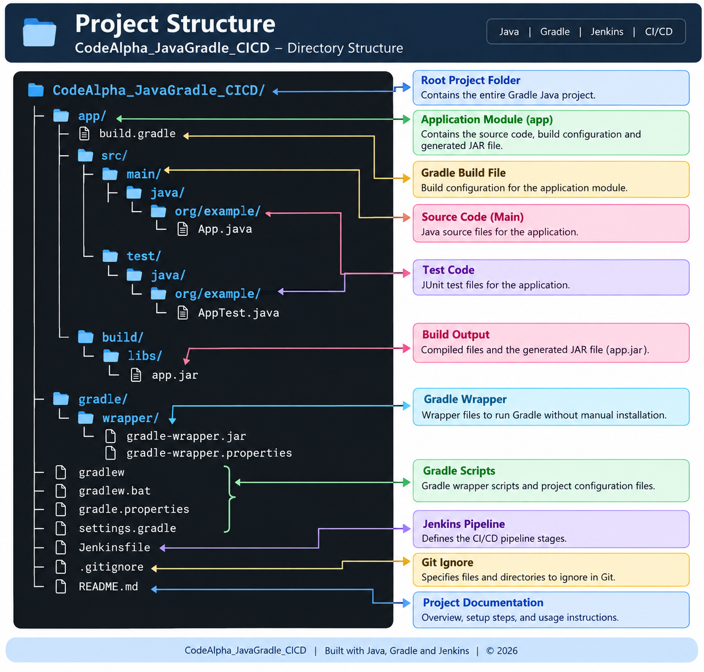

# CodeAlpha Java Application using Gradle -- CI/CD

##  Project Overview

This project demonstrates how to build, test, package, and deploy a
**Java application using Gradle and Jenkins CI/CD** on an **AWS EC2
Ubuntu instance**.

The project was completed as part of the **CodeAlpha Internship** and
focuses on practical DevOps concepts such as:

-  Java application development
-  Gradle build automation
-  Dependency management
-  Automated testing
-  Git and GitHub version control
-  Jenkins Continuous Integration (CI)
-  JAR artifact archiving
-  Continuous Delivery/Deployment (CD)
-  AWS EC2-based application deployment

###  Project Workflow

``` text
Java Application
       │
     Gradle
(Build + Test + JAR)
       │
     GitHub
       │
     Jenkins
       |──>Checkout
       ├──>Build
       ├──>Test
       ├──>Archive JAR
       └──>Deploy
       │
 AWS EC2 Ubuntu
       │
 Running Java Application
```

#  Technologies Used

  Technology     Purpose
  -------------- --------------------------------------------
  Java 21        Application development
  Gradle         Build automation and dependency management
  JUnit          Unit testing
  Git            Version control
  GitHub         Source code repository
  Jenkins        CI/CD automation
  AWS EC2        Cloud server and deployment environment
  Linux/Ubuntu   Server operating system

# Project Structure

The project was created as a Gradle Java application project.


``` text
CodeAlpha_JavaGradle_CICD/
│
├── app/
│   ├── build.gradle
│   ├── src/
│   │   ├── main/
│   │   │   └── java/
│   │   │       └── org/example/
│   │   │           └── App.java
│   │   │
│   │   └── test/
│   │       |── java/
│   │           └── org/example/
│   │               └── AppTest.java
│   │
│   └── build/
│       └── libs/
│           └── app.jar
│
├── gradle/
│   └── wrapper/
│       ├── gradle-wrapper.jar
│       └── gradle-wrapper.properties
│
├── gradlew
├── gradlew.bat
├── gradle.properties
├── settings.gradle
├── Jenkinsfile
├── .gitignore
└── README.md
```

> **Note:** The Gradle Wrapper (`gradlew`) is used in the project so
> that Jenkins can use the project's configured Gradle version instead
> of depending on the older system Gradle installation.

# Step 1 -- Create an AWS EC2 Instance

An Ubuntu EC2 instance was created to act as the development, Jenkins,
and deployment server.

The instance provides the Linux environment required to install Java,
Gradle, Jenkins, and run the final JAR application.


#  Step 2 -- Connect to the EC2 Instance

After creating the instance, an SSH connection was established to access
the Ubuntu server through the terminal.

``` bash
ssh -i <your-key.pem> ubuntu@<EC2-PUBLIC-IP>
```

After successful login, the Ubuntu terminal was ready for project setup.


#  Step 3 -- Install Java and Gradle

Java was installed and configured on the Ubuntu instance. **Java 21** is
used by the project and Jenkins.

Gradle was also installed. Because the system Gradle version can be
older, the project uses the **Gradle Wrapper** (`./gradlew`) for actual
project builds.

To verify Java:

``` bash
java -version
```

To verify Gradle:

``` bash
gradle -version
```


#  Step 4 -- Set Up the Gradle Project

A new Gradle Java application was initialized.

The Gradle initialization process creates the basic project structure,
build configuration, source files, test files, and Gradle Wrapper.

The project uses:

``` bash
./gradlew
```

instead of relying on the system-wide Gradle version.


# ☕ Step 5 -- Configure the Java Application

The Java application source code and Gradle configuration were created
inside the `app` module.

Main application:

``` text
app/src/main/java/org/example/App.java
```

Unit test:

``` text
app/src/test/java/org/example/AppTest.java
```

The Gradle build file contains the application configuration and
required dependencies.


#  Step 6 -- Build and Test Before Jenkins

Before integrating Jenkins, the application was tested locally using
Gradle.

The main commands used were:

``` bash
./gradlew test
```

and:

``` bash
./gradlew build
```

A successful build confirms that:

-   Java source code compiles correctly.
-   Unit tests pass.
-   Gradle can resolve the required dependencies.
-   The application can be packaged into a JAR file.

The generated JAR is located at:

``` text
app/build/libs/app.jar
```


#  Step 7 -- Connect the Project to GitHub

Git was initialized in the project directory and the project was
committed to the `main` branch.

Example commands:

``` bash
git init
git branch -M main
git add .
git commit -m "Initial java Gradle project"
```

The GitHub repository used for this project is:

**CodeAlpha_JavaGradle_CICD**

GitHub repository:

[Open the GitHub
repository](https://github.com/Bhargavi-Thalari/CodeAlpha_JavaGradle_CICD)

The project was pushed from the EC2 instance to GitHub using Git
authentication.


#  Step 8 -- Configure Jenkins

Jenkins was installed on the Ubuntu EC2 instance and accessed through
the Jenkins web interface.

Jenkins was configured to run with Java 21.

The initial Jenkins setup requires unlocking Jenkins with the
administrator password generated during installation.


#  Step 9 -- Verify Jenkins Is Ready

After completing the initial setup, Jenkins displayed the **"Jenkins is
ready!"** page.

This confirms that Jenkins was successfully installed and configured.


#  Step 10 -- Configure the Jenkins Pipeline

A Jenkins Pipeline job was created for the Java Gradle project.

The pipeline was connected to the GitHub repository and configured to
use the repository's `Jenkinsfile`.

The pipeline automates the following activities:

``` text
Checkout
   ↓
Build
   ↓
Test
   ↓
Archive JAR
   ↓
Deploy
```


#  Step 11 -- Run the Jenkins Pipeline

The Jenkins pipeline was executed successfully.

The console output shows that Jenkins:

1.  Checked out the source code.
2.  Used the Gradle Wrapper.
3.  Built the Java application.
4.  Executed the tests.
5.  Completed the pipeline successfully.

A successful Jenkins build demonstrates the **Continuous Integration
(CI)** part of the project.


#  Step 12 -- Archive the Generated JAR

After the Gradle build completed, Jenkins archived the generated JAR
file as a build artifact.

Artifact location:

``` text
app/build/libs/app.jar
```

Archiving the JAR is useful because the exact output of a successful
build can be retained and used by later deployment stages.

This demonstrates artifact management as part of the CI/CD workflow.


#  Step 13 -- Add the Deployment Stage

A deployment stage was added to the Jenkins pipeline.

The deployment stage runs after the build, test, and artifact steps have
completed successfully.

A simplified deployment stage can be represented as:

``` groovy
stage('Deploy') {
    steps {
        sh 'java -jar app/build/libs/app.jar'
    }
}
```

> The exact Jenkinsfile in this repository should be treated as the
> source of truth for the final pipeline configuration.


#  Step 14 -- Execute the Deployment Stage

The deployment stage was executed through Jenkins after the CI stages
completed successfully.

The JAR generated by Gradle is used as the application package.

``` text
Gradle Build
     ↓
app.jar
     ↓
Jenkins Deploy Stage
     ↓
java -jar app/build/libs/app.jar
```


#  Step 15 -- Verify the Deployment Pipeline

The Jenkins pipeline overview shows the completed stages and their
successful execution.

This provides visual confirmation that the CI/CD workflow is working
from source checkout through deployment.


#  Step 16 -- Final Verification

The final verification confirms that the Java application was
successfully built, packaged, and deployed through the Jenkins pipeline.

The completed workflow demonstrates:

``` text
GitHub
  ↓
Jenkins
  ↓
Gradle Build
  ↓
Unit Tests
  ↓
JAR Artifact
  ↓
Deployment
  ↓
Java Application
```


#  Run the Project Manually

Clone the repository:

``` bash
git clone https://github.com/Bhargavi-Thalari/CodeAlpha_JavaGradle_CICD.git
cd CodeAlpha_JavaGradle_CICD
```

Make the Gradle Wrapper executable on Linux:

``` bash
chmod +x gradlew
```

Build the project:

``` bash
./gradlew clean build
```

Run the tests:

``` bash
./gradlew test
```

Run the application:

``` bash
./gradlew :app:run
```

Or run the generated JAR:

``` bash
java -jar app/build/libs/app.jar
```

#  Gradle Dependency Management

Gradle manages the libraries required by the Java application.

Instead of manually downloading JAR files, dependencies are declared in
the Gradle build configuration.

This provides:

-   Automatic dependency downloading
-   Reproducible builds
-   Centralized dependency configuration
-   Easier dependency updates
-   Integration with automated CI/CD


#  CI/CD Explanation

## Continuous Integration (CI)

CI automatically builds and tests the application whenever changes are
integrated into the repository.

In this project:

``` text
Developer
   ↓
GitHub
   ↓
Jenkins
   ↓
Gradle Build
   ↓
Automated Tests
```

If the build or tests fail, the pipeline can stop before deployment.

## Continuous Delivery / Deployment (CD)

After the application successfully passes the CI stages, Jenkins
proceeds to the deployment stage.

``` text
Successful Build
      ↓
JAR Artifact
      ↓
Deploy
      ↓
Run Java Application
```

This reduces manual deployment work and creates a repeatable release
process.


# ⭐ Conclusion

This project successfully demonstrates a complete Java CI/CD workflow
using **Gradle, GitHub, Jenkins, and AWS EC2**.

The application is built and tested using Gradle, the source code is
maintained in GitHub, Jenkins automates the CI/CD pipeline, the
generated JAR is archived as an artifact, and the application is
deployed on the EC2 environment.

This project provides practical experience with the core DevOps
workflow:

**Code → Build → Test → Package → Archive → Deploy**
